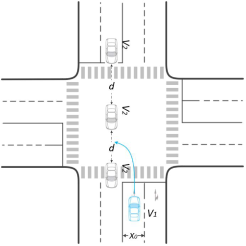
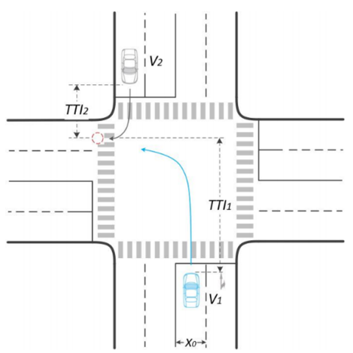
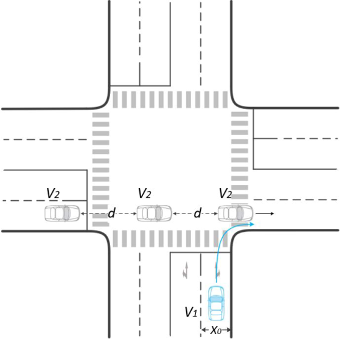
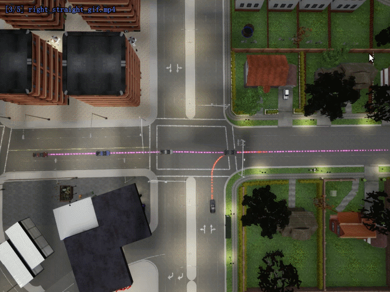
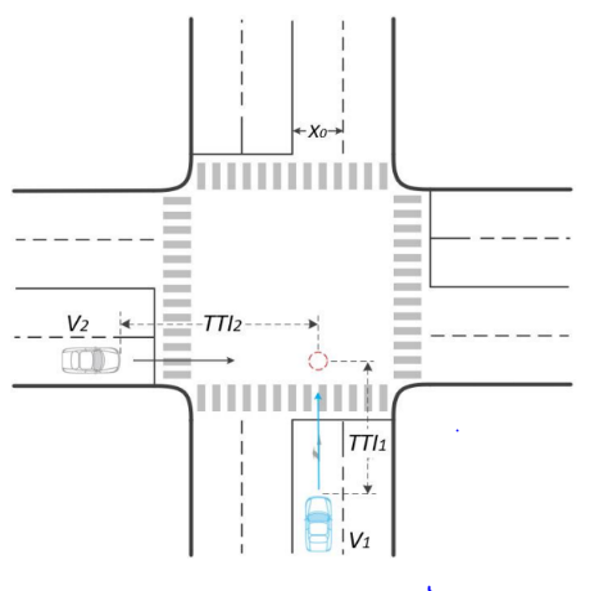
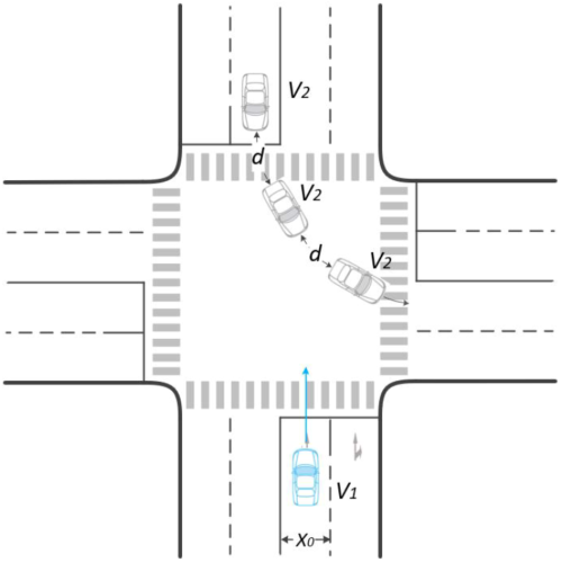

#  Complex Urban Scenarios for Autonomous Driving

## 1 Introduction
This repository contains codes for the Complex Urban Scenarios for Autonomous Driving under intersection scenarios.
In this repository, we deploy a set of autonomous agents developed based on Reinforcement learning(RL) methods.


## 2 Get started
### 2.0 system requirements
Ubuntu 16.04-18.04  
CARLA 0.9.10.1 and above


### 2.1 set-up environment
Anaconda is suggested for python environment management. 
First of all, create the conda env with  
`conda env create -f gym_carla.yml -n gym_carla`
then a conda env named with gym_carla will be created, 
the conda env can be activated with command  
`conda activate gym_carla`

Before you do anything, please make sure the carla client is running correctly,
following carla commands are suggested:
`./CarlaUE4.sh -opengl -quality-level=Low -ResX=400 -ResY=300 -carla-rpc-port=2000`
Carla port number is alternative, however you should make sure it coordinates with the value in the codes.

Fix the carla root path to get the available carla python API by fixing   
`./train/gym_carla/config/carla_config.py`  
Replace the `root_path` with your own path.

### 2.1 training
Entrance of the training can be found in   
`./train/rl_agents/td3/single_task_without_attention`

You can train the RL agent with specified task by running `rl_agent.py`  
Some parameters are provided for more training set-ups.  
Use `python rl_agent.py --help` to learn the usage of available parameters.

During the training procedure, checkpoints and best models will be saved in `./outputs/`.

We provide a baseline agent with trained weights stored in  
`train/rl_agents/challenge_agents/test_agents`  
You can replace the weight file in `model_dict` folder with your own trained model.

### 2.2 Testing

#### 2.2.1 Running the test

In order to test trained agent in testing scenarios, please run the 
`./test/scenario_runner/run_scenario_test.py`
An agent file is supposed to be assigned, for example, you can run the script with following args:  
```angular2html
python run_scenario_test.py
--sync
--reloadWorld
--timeout 99999
--port 2000
--trafficManagerPort 8100
--scenario TestContinuous-right-negative_x-straight
--agent $Your parent folder$/ComplexUrbanScenarios/train/rl_agents/challenge_agents/test_agents/test_agent.py
--speed-range 10 12 2
--distance-range 34 36 2
--tag test
```

#### 2.2.2 Testing your model
We deploy a set of traffic scenarios for testing the trained agent.
If you wish to test your trained agent, please put your tensorflow NN weights in   
`train/rl_agents/challenge_agents/test_agents/model_dict`  
Model dict should be put in correct folder of different task.

#### 2.2.3 Available scenarios

In this repository, we propose 5 intersection scenarios based on 
[T/CMAX standard](http://mzone.site/Uploads/Editor/2021-01-07/5ff67954ba9fc.pdf).
All 5 scenarios are added to our test set, users can select desired scenarios form   
`./test/scenario_runner/srunner/examples/IntersectionContinuousTraffic.xml`  
Testing params are available for all 5 scenarios.


## 3 Intersection Scenarios
In this part, a series of scenarios of urban intersection are deployed to validate the
performance of the RL agent.
We develop traffic scenarios using CARLA scenario_runner module.

We select 5 challenging scenarios of intersection scenarios:

 - turning left meeting going straight traffic flow  

[comment]: <> (![avatar]&#40;Docs/gifs/left_straight.gif&#41;  )

<div align="left">


</div>

- turning left meeting turning right traffic flow

[comment]: <> (![avatar]&#40;Docs/gifs/left_right.gif&#41;)
  
<div align="left">


</div>


- turning right meeting going straight traffic flow

[comment]: <> (![avatar]&#40;Docs/gifs/right_straight.gif&#41;)
  
<div align="left">


</div>

- going straight meeting going straight traffic flow

[comment]: <> (![avatar]&#40;Docs/gifs/straight_straight.gif&#41;)
  
<div align="left">


</div>

- going straight meeting turning left traffic flow

[comment]: <> (![avatar]&#40;Docs/gifs/straight_left.gif&#41;)
  
<div align="left">


</div>

All these 5 intersection scenarios are facing great challenges from collision risk.
The autonomous vehicle must find a proper timing to cross the traffic flow to finish the determined route.

## 4 Baselines & Results 
In our work, we deploy a td3 agent to handle the intersection turning task.
Here are the testing results of our proposed traffic scenarios.

Besides, we provide 2 rules-based method as baselines, which are AEB agent and IDM agent.
You can find them in `train/rl_agents/challenge_agents/baselines`

[comment]: <> (### Sceario 1: Left turning with oppose continuous traffic flow turning left)


[comment]: <> (### Sceario 2: Left turning with oppose continuous traffic flow turning left)


## Citation

[comment]: <> (@misc{lia_corrales_2015_15991,)

[comment]: <> (    author       = {Lia Corrales},)

[comment]: <> (    title        = {{dust: Calculate the intensity of dust scattering halos in the X-ray}},)

[comment]: <> (    month        = mar,)

[comment]: <> (    year         = 2015,)

[comment]: <> (    doi          = {10.5281/zenodo.15991},)

[comment]: <> (    version      = {1.0},)

[comment]: <> (    publisher    = {Zenodo},)

[comment]: <> (    url          = {https://doi.org/10.5281/zenodo.15991})

[comment]: <> (    })

